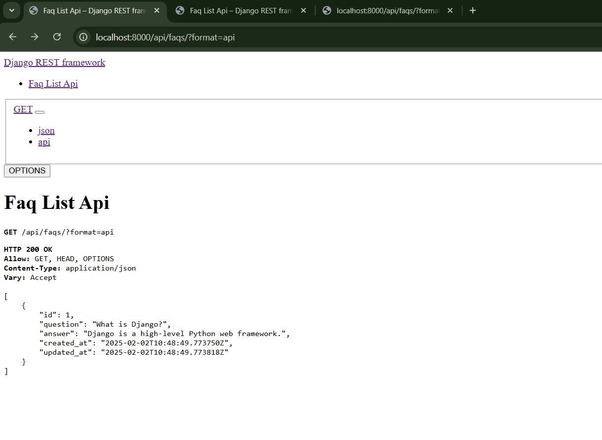
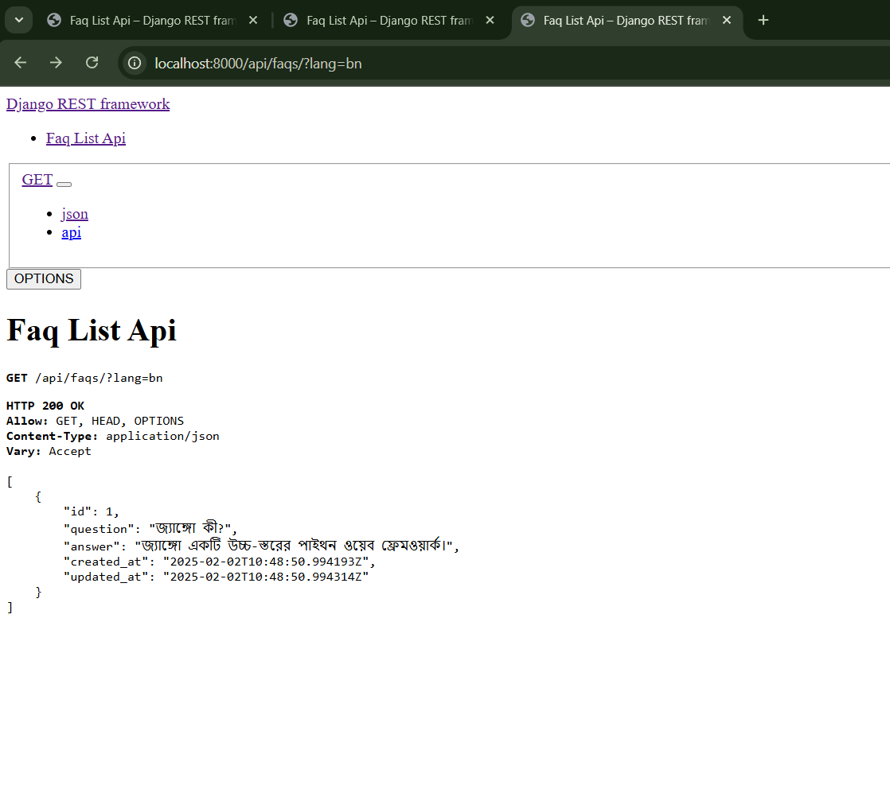
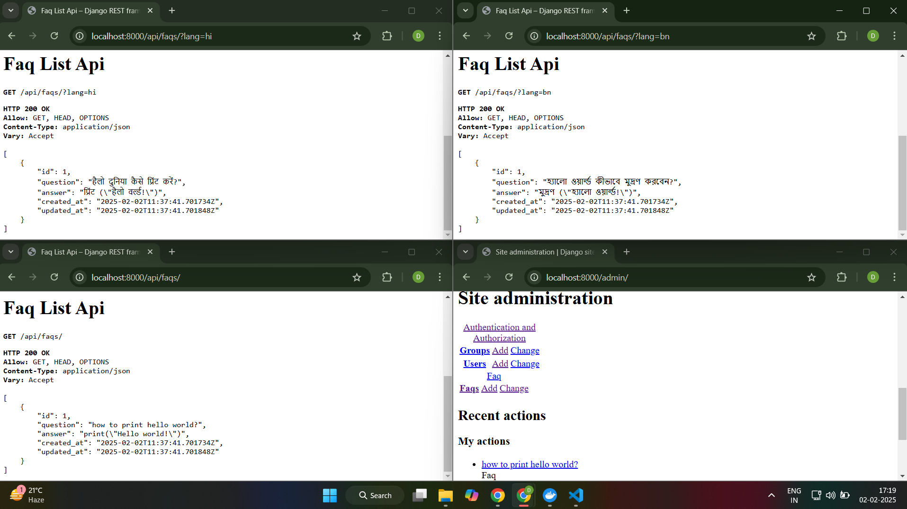

## Multilingual FAQ Django Project

This project is a backend application for managing FAQs in multiple languages. It includes:

- A Django model with fields for English and translated content.
- Automated translations using `googletrans` on object creation.
- A WYSIWYG editor integrated via `django-ckeditor`.
- A REST API (with language selection using a `?lang=` query parameter).
- Caching implemented via Redis.
- An Admin interface for FAQ management.
- Unit tests covering key functionality.
- Docker support for easy deployment.

## Features

- **Model Design:** FAQ model with fields for `question` and `answer` (rich text) in English, Hindi (`hi`), Bengali (`bn`), etc.
- **WYSIWYG Editor:** Integrated using django-ckeditor.
- **REST API:** Built with Django REST Framework. Use the `?lang=` parameter to fetch FAQs in the desired language.
- **Caching:** API responses are cached using Redis.
- **Automatic Translation:** Uses `googletrans` to automatically translate content on save (with fallback to English).
- **Admin Interface:** User-friendly admin interface for managing FAQs.
- **Unit Tests:** Basic tests covering model translation methods and API responses.
- **Docker Support:** Easily run the application using Docker & docker-compose.

## API Usage
English (default):
```bash
curl http://localhost:8000/api/faqs/
```
Hindi:
```bash
curl http://localhost:8000/api/faqs/?lang=hi
```
Bengali:
```bash
curl http://localhost:8000/api/faqs/?lang=bn
```
Admin Panel:
```bash
curl http://localhost:8000/admin
```

## Preview

Here are some previews of the project:

### Image 1


### Image 2


### Image 3


### Installation

```bash
git clone https://github.com/DevyanshMalhotra/faq_project.git
cd faq_project
python -m venv venv
source venv/bin/activate        # On Windows: venv\Scripts\activate
pip install --upgrade pip
pip install -r requirements.txt
python manage.py makemigrations
python manage.py migrate
python manage.py createsuperuser
python manage.py runserver
```

### Docker-Commands

```bash
docker-compose up --build
docker-compose exec web python manage.py migrate
docker-compose exec web python manage.py createsuperuser
docker-compose exec web python manage.py test faq.tests 
```
